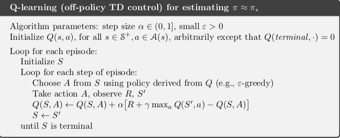
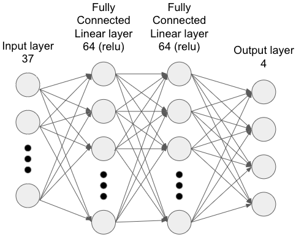
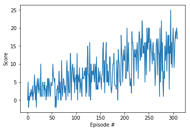

# Navigation Project Report

### Learning Algorithm

In this project, I use a Deep-Q Algorithm inspired by the [original DeepMind Deep Q-Network paper]((https://storage.googleapis.com/deepmind-media/dqn/DQNNaturePaper.pdf) using PyTorch and Python 3 to solve the banana navigation environment.

  

The difference between the Q-learning Algorithm (shown above) and the Deep Q-Network Algorithm is the use of experience replay to combat the risk of updating with correlated sequential order runs. And the use of a neural network to update the Q values.

The Neural Network used is comprised of two fully connected linear layers (dense layers) each with 64 nodes with a relu activation function. Below is a representation of the network. The 37 state inputs are fed in and the output has 4 output nodes each corresponding to a possible action.



The overall Deep Q-Network is setup to run until it has reached its goal of an average score of +13 over the last 100 episodes or up to 2000 episodes.

Epsilon starts at 1 and decays by half (eps_decay=0.5) every episode to a floor of epsilon=0.01.

*Other parameters used:*
```
BUFFER_SIZE = int(1e5)  # replay buffer size  
BATCH_SIZE = 64         # minibatch size  
GAMMA = 0.99            # discount factor  
TAU = 1e-3              # for soft update of target parameters  
LR = 5e-4               # learning rate  
UPDATE_EVERY = 4        # how often to update the network
```

### Plot of Rewards
Episode 100	Average Score: 3.76  
Episode 200	Average Score: 7.24  
Episode 300	Average Score: 12.46  
Episode 310	Average Score: 13.04  
**Environment solved in 310 episodes!**	Average Score: 13.04  


### Ideas for Future Work
It would be interesting to benchmark other reinforcement learning algorithms that do not use deep neural nets. What would be the performance be of plain on-policy SARSA?

Another idea that would be to benchmark improvements to the Deep Q-Network algorithm like [Double DQN](https://arxiv.org/abs/1509.06461) [(more on overestimating action values)](https://www.ri.cmu.edu/pub_files/pub1/thrun_sebastian_1993_1/thrun_sebastian_1993_1.pdf), [Prioritized Experience Replay](https://arxiv.org/abs/1511.05952), [Dueling DQN](https://arxiv.org/abs/1511.06581), [multi-step bootstrap targets](https://arxiv.org/abs/1602.01783), [Distributional DQN](https://arxiv.org/abs/1707.06887), [Noisy DQN](https://arxiv.org/abs/1706.10295) from papers. Or put them all together to create the [Rainbow DQN](https://arxiv.org/abs/1710.02298) tested by researchers at Google DeepMind.
