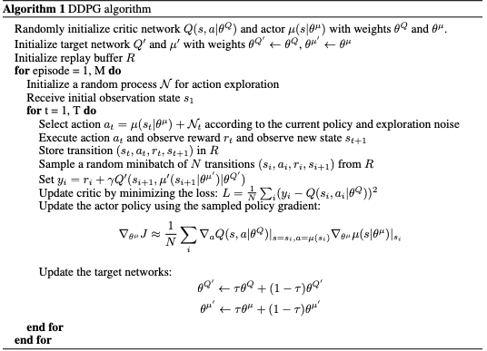
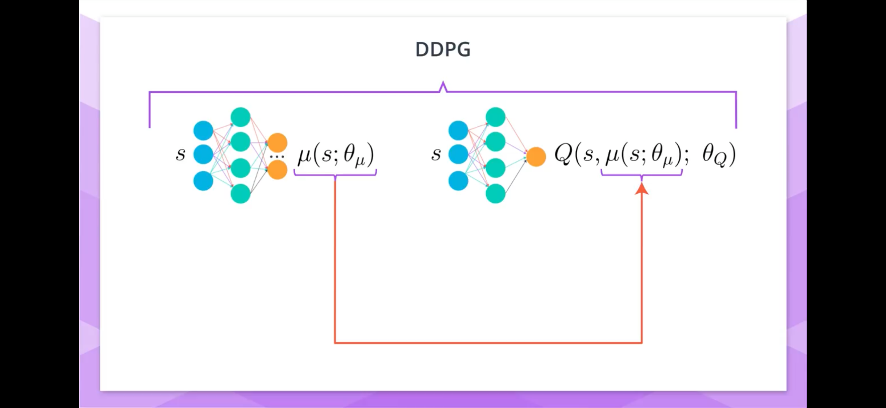
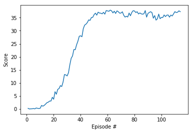

# Continuous Control Project Report

### Learning Algorithm: DDPG


[Algorithm description taken from the original DDPG paper](https://arxiv.org/pdf/1509.02971.pdf)

The four action vectors in this environment (corresponding to the torque applicable to the two joints) are **continuous values between -1 and 1.**

For the continuous action space, the learning algorithm I used is **the Deep Deterministic Policy Gradient Algorithm - DDPG**. This algorithm is similar to Deep-Q Network in that there is a target network that is guiding training the policy. However, DDPG being a policy-based method, the algorithm search directly for the optimal policy without simultaneously maintaining a value function estimate needing a discrete action space.

#### More Details on the DDPG algorithm

**What roles does the actor and critic networks play?**


In DDPG, the actor is used to learn the best policy deterministically or the best possible action for any given state (argmax_aQ(s,a)). The critic uses the best believed action to generate an estimate of the action-value function.


**What is the formula/computation for weight updates?**
The actor updates weights using gradient ascent and specifically the opposite direction of [adam optimizer](https://machinelearningmastery.com/adam-optimization-algorithm-for-deep-learning/) which is based on stochastic gradient descent with improvements.  

The critic uses the adam optimizer as well but calculates the loss to be minimized as the mean squared error between the Q_targets and the Q_expected.

**How about the local and target networks?**
To create a stable learning environment, the target networks are provided soft updates based on the formula `θ_target = τ*θ_local + (1 - τ)*θ_target` where I've set τ=1e-3 in this implementation. This is outlined as an improvement in the [original DDPG paper](https://arxiv.org/pdf/1509.02971.pdf) over DQN's updating the target network entirely a certain number of timesteps.

**When are experiences added to the replay buffer and what are the steps of the overall simulation during the training procedure?**
Experiences for each of the 20 agents are added to the replay buffer every episode. Once there are enough experiences added to the replay buffer as defined by the variable BATCH_SIZE (in this case BATCH_SIZE=128), experiences are sampled for learning.


##### Hyperparameters
The hyperparameters used to define the DDPG algorithm to solve this environment closely resembles what is used in the Udacity deep-reinforcement-learning github repo for the openai pendulum environment.

What I found helped the algorithm perform well is changing the learning rate of the critic to be the same as the actor at 1e-4. When the learning rate for the critic was set to 1e-3, the algorithm did not learn to solve the environment and score plateaued before hitting the average score of 30.  

```python
# Hyperparmeters Used
BUFFER_SIZE = int(1e5)  # replay buffer size  
BATCH_SIZE = 128        # minibatch size  
GAMMA = 0.99            # discount factor  
TAU = 1e-3              # for soft update of target parameters  
LR_ACTOR = 1e-4         # learning rate of the actor  
LR_CRITIC = 1e-4        # learning rate of the critic  
WEIGHT_DECAY = 0        # L2 weight decay  
```

##### Neural Net Model Architecture
The actor and critic both use two full-connected layers with a relu activation function on each layer. The first FC layer comprises of 512 nodes and the second of 256 nodes. The actor output undergoes the tanh activation function which keeps the output of the network between -1 and 1.

Ornstein-Uhlenbeck noise is applied to action to push the agent to explore the space. The parameters used are mu=0., theta=0.15, sigma=0.2 for the OUnoise.

### Plot of Rewards
Episode 100     Average Score: 25.03
Episode 114     Average Score: 30.04
Environment solved in 114 episodes!     Average Score: 30.04



### Ideas for Future Work
Benchmark different algorithms like vanilla PPO and actor-critic algorithms like A3C, A2C, GAE.


[OpenAI has a blog post](https://blog.openai.com/better-exploration-with-parameter-noise/) showing that adding noise to the parameters instead of the resulting action. I would like to implement the change and benchmark the performance to see what difference it makes in this environment.
