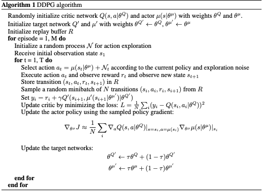

# Tennis Project Report

### Learning Algorithm: MADDPG

#### Building off of DDPG

[Algorithm description taken from the original DDPG paper](https://arxiv.org/pdf/1509.02971.pdf)

In this environment we have two independent agents that have an observation space of 8 continuous variables. And two actions that are also variable (toward or away from net and jumping).

For the continuous action space, the learning algorithm I used a modified version of **the Deep Deterministic Policy Gradient Algorithm - DDPG**. This algorithm is similar to Deep-Q Network in that there is a target network that is guiding training the policy. However, DDPG being a policy-based method, the algorithm search directly for the optimal policy without simultaneously maintaining a value function estimate needing a discrete action space.

#### Solving issues with multiple Agents
By definition with multiple agents, the environment is changing (non-statoinary) from the perspective of a single agent since there is another agent learning and adapting to the same environment. With the MADDPG algorithm [paper](https://papers.nips.cc/paper/7217-multi-agent-actor-critic-for-mixed-cooperative-competitive-environments.pdf), the idea is to share states, actions and rewards of both agents in training while maintaining individual agents when executing. In other words, a centralized critic and decentralized actors. To achieve this, we add the states, actions and rewards of both agents to a centralized replay buffer.


[Diagram from MADDPG paper](https://papers.nips.cc/paper/7217-multi-agent-actor-critic-for-mixed-cooperative-competitive-environments.pdf)

It is also challenging to find the right hyperparameters. We implement noise decay to help create a more stable learning environment after some episodes.


#### More Details on the DDPG algorithm

**What roles does the actor and critic networks play?**


In DDPG, the actor is used to learn the best policy deterministically or the best possible action for any given state (argmax_aQ(s,a)). The critic uses the best believed action to generate an estimate of the action-value function.


**What is the formula/computation for weight updates?**
The actor updates weights using gradient ascent and specifically the opposite direction of [adam optimizer](https://machinelearningmastery.com/adam-optimization-algorithm-for-deep-learning/) which is based on stochastic gradient descent with improvements.  

The critic uses the adam optimizer as well but calculates the loss to be minimized as the mean squared error between the Q_targets and the Q_expected.

**How about the local and target networks?**
To create a stable learning environment, the target networks are provided soft updates based on the formula `θ_target = τ*θ_local + (1 - τ)*θ_target` where I've set τ=5e-2 in this implementation. This is outlined as an improvement in the [original DDPG paper](https://arxiv.org/pdf/1509.02971.pdf) over DQN's updating the target network entirely a certain number of timesteps.

**When are experiences added to the replay buffer and what are the steps of the overall simulation during the training procedure?**
Experiences for each of the 2 agents are added to the replay buffer every episode. Once there are enough experiences added to the replay buffer as defined by the variable BATCH_SIZE (in this case BATCH_SIZE=128), experiences are sampled for learning.


##### Hyperparameters
The algorithm is sensitive to the hyperparameters. It is easy to change a few a little and have it not converge in 2000 episodes which was my self-imposed cutoff.

```python
# Hyperparmeters Used
BUFFER_SIZE = int(1e6)  # replay buffer size
BATCH_SIZE = 128        # minibatch size
GAMMA = 0.99            # discount factor
TAU = 5e-2              # for soft update of target parameters
LR_ACTOR = 1e-3         # learning rate of the actor
LR_CRITIC = 1e-3        # learning rate of the critic
WEIGHT_DECAY = 0        # L2 weight decay
ADD_NOISE = True
eps_start = 6           # Noise level start
eps_end = 0             # Noise level end
eps_decay = 250         # Number of episodes to decay over from start to end

```

##### Neural Net Model Architecture
The actor and critic both use two full-connected layers with a relu activation function on each layer. The first FC layer comprises of 256 nodes and the second of 128 nodes. The actor output undergoes the tanh activation function which keeps the output of the network between -1 and 1.

Ornstein-Uhlenbeck noise is applied to action to push the agent to explore the space. The parameters used are mu=0., theta=0.15, sigma=0.2 for the OUnoise.

### Plot of Rewards
(Note: Max reward is the last episode max and not the max over 100 episodes. It is used while watching progress.)  

Episode 100	Max Reward: 0.00 Average Score: 0.01  
Episode 200	Max Reward: 0.00 Average Score: 0.03  
Episode 300	Max Reward: 0.10 Average Score: 0.07  
Episode 400	Max Reward: 0.30 Average Score: 0.14  
Episode 500	Max Reward: 0.10 Average Score: 0.25  
Episode 600	Max Reward: 0.10 Average Score: 0.38  
Episode 625	Max Reward: 2.60 Average Score: 0.52  
**Environment solved in 625 episodes!	Average Score: 0.52**  


### Ideas for Future Work
One idea is to implement a hyperparameter search with another neural network to learn optimal values. The growing number of hyperparameters and possible neural network models make the search space large.


[OpenAI has a blog post](https://blog.openai.com/better-exploration-with-parameter-noise/) showing that adding noise to the parameters instead of the resulting action. I would like to implement the change and benchmark the performance to see what difference it makes in this environment.
